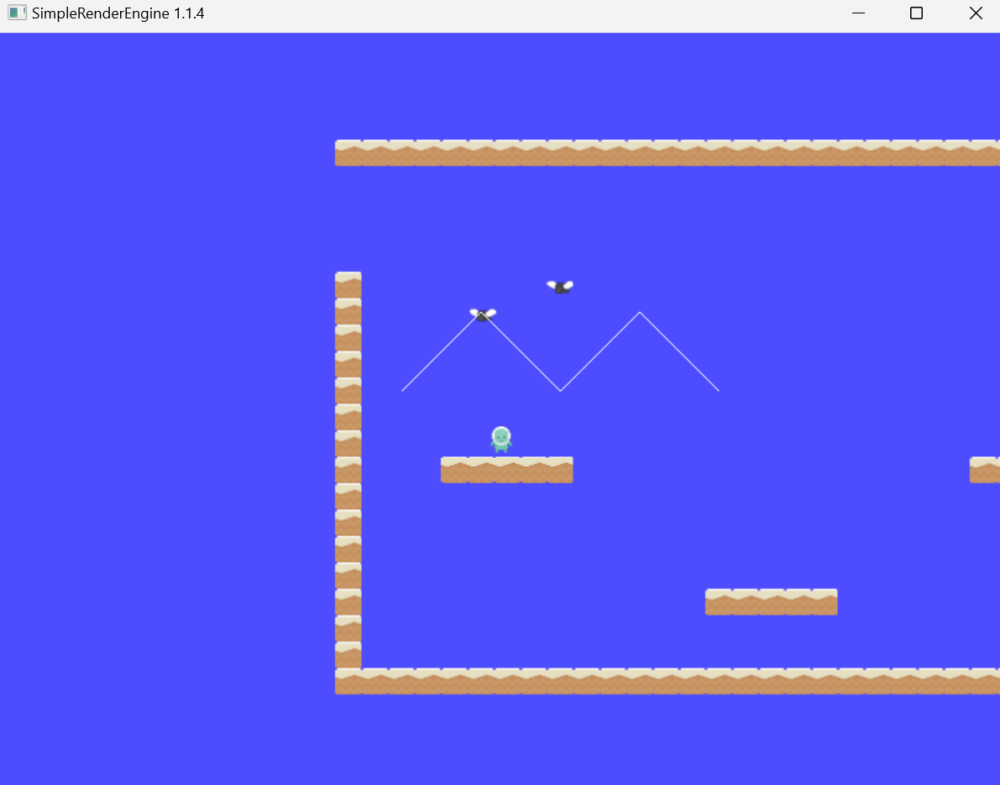

# Exercise 10

For you exercise to be evaluated, it must be able to be run following these steps:

Drag and drop the submission folder inside SimpleRenderEngineProject
Add submission folder as subdirectory in SimpleRenderEngineProject/CMakeLists.txt Please check that this is possible before submission, if not we will notify you.

## Controls

|    |           |
|-------|-----------------|
| AD    | move left right |
| Space | jump            |
| F1    | SRE debugger    |
| F2    | b2d debugger    |

# 10.1 Platform easing functions
Add at least two different non-linear easing functions in `ComponentPlatformMove`.

# 10.2 NPC movement using Bezier curves
Replace the linear interpolation in  `ComponentSpline::Update` with a Bezier. The given `_points` should be the control points of the curve, but you will need to handle the tangent points yourself. Two possible options are:
- add another array of points
- compute them parametrically from the control points

# 8.3 Cel animations
Change the `ComponentController` (or create a new `ComponentAnimator`to do so) so that
- if the character has `0` velocity, it uses the `standing` sprite
- if the character has `> 0` velocity AND it is `grounded`, it alternates between `walk1` and `wal2` sprites. Choose an appropriate animation speed based on horizontal velocity
- if the character is `not grounded`, it uses `flyUp`, `fly` and `flyDown` for the three phases of the jump
- if the character is moving towards the left, the sprite is flipped along the x-axis

In the atlas, the afromentioned sprites are:

19 | standing
20 | walk1
21 | walk2
26 | flyUp
27 | fly
28 | flyDown

# Challenge: Scripted components
The objective of this exercise is to create a scripted component architecture using the `sol` library for low-level bindings with Lua.

As a first step:
1. implement the `ScriptedComponent` class so that it can read a file name and function name from the `serializedData`
2. initialize `sol` and load the desired script/function
3. execute the function on update
To test that everything works, try to make the associated gameObject move periodically left and right.

After the first basic functionality is ready, try to embed the `sol` state and initialization in the engine, to minimize the resource consuption. In other words:
- there should be a single `sol::state` in your game
- every script should be loaded no more than once (see how textureAtlases are handled in MyEngine)
